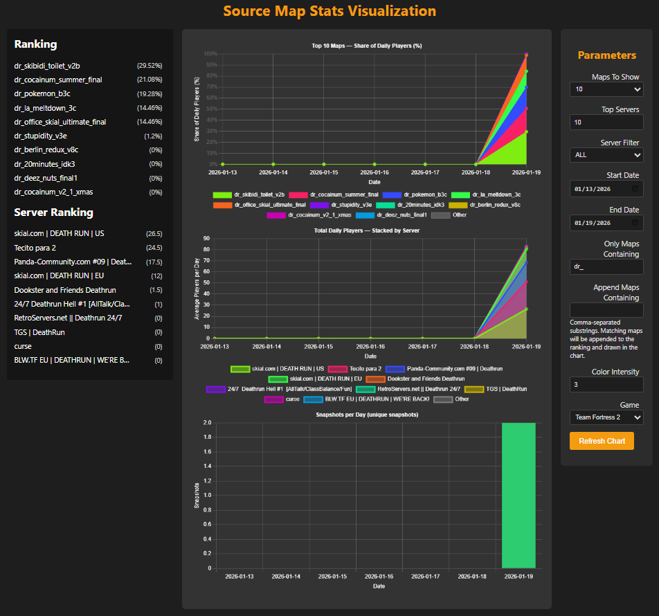

# SourceMapStats

**SourceMapStats** is an end-to-end statistics dashboard for Valve Source / GoldSource games.  
It periodically queries public game servers, stores per-map player counts in a DuckDB database, and serves an interactive Chart.js dashboard so you can explore which maps are really being played over time.

 

---

## Table of Contents
- [SourceMapStats](#sourcemapstats)
  - [Table of Contents](#table-of-contents)
  - [Why?](#why)
  - [Live Demo](#live-demo)
  - [Quick start](#quick-start)
    - [1. Clone \& install](#1-clone--install)
    - [2. Set your Steam API key](#2-set-your-steam-api-key)
    - [3. Run the server](#3-run-the-server)
    - [4. Start the crawler from the UI](#4-start-the-crawler-from-the-ui)
    - [5. (Optional) Set up as a system service](#5-optional-set-up-as-a-system-service)
  - [Local vs public mode](#local-vs-public-mode)
    - [How to expose the service](#how-to-expose-the-service)
  - [Configuration](#configuration)
  - [Security Recommendations](#security-recommendations)
  - [REST API](#rest-api)

---

## Why?

I built SourceMapStats for a personal project: I wanted concrete data about which **Team Fortress 2** maps people really play.  
The scanner, however, is game-agnostic - just change the `Game` parameter and it will happily crawl any Source engine title available via the Steam Web API.

---

## Live Demo

Visit the [live demo](https://tf2stats.r60d.xyz/) to see SourceMapStats in action.

> **Note:** By default the server binds **only to localhost** for safety.  
> If you enable public mode (see below) you can replace `127.0.0.1` with your machine's LAN or public IP.

---

## Quick start

> Requires **Python 3.10+** (recommended for modern ecosystem features) and **git**.

### 1. Clone & install

```bash
git clone https://github.com/Ultikynnys/SourceMapStats.git
cd SourceMapStats
chmod +x run_app.sh
```

### 2. Set your Steam API key

SourceMapStats uses a `.env` file for configuration. It requires a Steam Web API key for fetching game server lists.

```bash
cp .env.example .env
nano .env
```

```ini
# Steam Web API key for fetching game server lists
# Get one free at https://steamcommunity.com/dev/apikey
STEAM_API_KEY=YOUR_STEAM_WEB_API_KEY
```

**Getting a Steam Web API key:**
1. Go to [https://steamcommunity.com/dev/apikey](https://steamcommunity.com/dev/apikey)
2. Log in with your Steam account
3. Register a new key (domain name can be anything, e.g., "localhost")
4. Copy the key into your `.env` file

> **Note:** The Steam API key is required for server scanning. Without it, the scanner cannot fetch the server list.

### 3. Run the server

```bash
```bash
./run_app.sh
```
```

The script autodetects your local IP and launches the Flask app through **Waitress**.  
Open `http://localhost:5000` (same machine) or `http://<server-ip>:5000` if you have enabled **public mode**.

### 4. View the dashboard

Open your browser to the server URL and the dashboard will display the collected data.
The server automatically starts scanning for game servers on startup.

> **Tip:** Let the crawler run continuously for **at least one month** to gather enough samples for reliable map-popularity trends. Shorter runs can be skewed by daily fluctuations and special events.

### 5. (Optional) Set up as a system service

To run SourceMapStats as a background service:

```bash
sudo cp sourcemapstats.service /etc/systemd/system/
sudo systemctl daemon-reload
sudo systemctl enable sourcemapstats
sudo systemctl start sourcemapstats
```

---

## Local vs public mode

For security SourceMapStats ships **private-first**.  
A single constant at the top of **`app.py`** controls where Waitress binds:

```python
################################################
# --------------[ Bind Mode Toggle ]-----------#
################################################
PUBLIC_MODE: bool = False  # <-- default (local-only)
```

| Setting | Effect | Reachability |
|---------|--------|--------------|
| `False` (default) | Waitress binds to `127.0.0.1` | Requests are accepted **only** from the same machine. |
| `True` | Waitress binds to `0.0.0.0` | The API can be reached from any interface/IP where the port is open. |

### How to expose the service

1. Edit **`app.py`** and flip the flag:

   ```python
   PUBLIC_MODE = True
   ```

2. Restart the server (`Ctrl-C` + re-run `./run_app.sh`).  
3. Ensure port `5000` is open (firewall / Docker `-p 5000:5000` / cloud security group).  
4. Visit:

   ```
   http://<server-ip>:5000
   ```

---

## Configuration

Configure SourceMapStats via the `.env` file:

```ini
# Steam Web API key (required)
STEAM_API_KEY=your-steam-api-key-here

# Game to track (optional, defaults to tf)
GAME_DIR=tf
```

### Supported Games

| GAME_DIR | Game |
|----------|------|
| `tf` | Team Fortress 2 (default) |
| `csgo` | Counter-Strike: Global Offensive |
| `cs2` | Counter-Strike 2 |
| `cstrike` | Counter-Strike 1.6 |
| `dod` | Day of Defeat |
| `hl2dm` | Half-Life 2: Deathmatch |
| `l4d` | Left 4 Dead |
| `l4d2` | Left 4 Dead 2 |

To change games, edit your `.env` file and restart the server.

**Server-side toggles:**
- **Public/Private Mode**: Controlled by `PUBLIC_MODE` in `app.py`.
- **Database Path**: Defaults to `sourcemapstats.duckdb`.

### Admin Panel

The admin panel provides request statistics and is protected by IP whitelist.

```ini
# In .env - comma-separated IPs allowed to access /admin
ADMIN_IPS=127.0.0.1,192.168.1.100
```

Access at `/admin` (only from whitelisted IPs). Shows:
- Total daily requests
- Unique IPs today
- Per-IP endpoint breakdown

---

## Storage backend

SourceMapStats uses an embedded **DuckDB** database.

- **File**: `sourcemapstats.duckdb`
- **Backup**: `sourcemapstats_replica.duckdb` (automatically maintained).
- **Legacy Support**: If a legacy CSV file is found on startup (and the DB is empty), it will be imported automatically.

---

## Security Recommendations

1. **Keep your Steam Web API key private** - do not commit it to version control.
2. **Use a strong firewall** if exposing publicly (allow port 5000 only).
3. **Waitress** is used as the production server; for high-traffic public use, consider a reverse proxy (Nginx/Apache).

---

## REST API

All endpoints are rate-limited to **60 req/15s** per IP.

### `GET /api/data`

Returns the collected statistics formatted for Chart.js.

**Query Parameters:**
| Param | Type | Default | Description |
|-------|------|---------|-------------|
| `days_to_show` | int | `7` | Number of past days to include. |
| `start_date` | Date | *(calculated)* | Start date (`YYYY-MM-DD`). Defaults to `today - days_to_show`. |
| `maps_to_show` | int | `10` | Number of top maps to display. |
| `top_servers` | int | `10` | (For server breakdown) Number of top servers to track explicitly. |
| `only_maps_containing` | str | *(empty)* | Comma-separated list of substrings to filter maps (e.g. `dr_,vsh_`). |
| `append_maps_containing` | str | *(empty)* | Comma-separated list of substrings to forcefully include in the chart. |
| `server_filter` | str | `ALL` | Filter data by specific server (`IP:PORT`). |
| `bias_exponent` | float | `1.2` | Weighting bias for daily averages. `>1` favors days with more samples. |
| `color_intensity` | int | `50` | Color generation seed/intensity for the chart. |
| `percision` | int | `2` | Rounding precision for averages (misspelled in API as `percision`). |

**Example:**
```bash
curl "http://localhost:5000/api/data?days_to_show=30&maps_to_show=5"
```

### Other Endpoints

| Method | Path | Description |
|--------|------|-------------|
| **GET** | `/api/data_freshness` | Returns timestamp of the latest scan cycle. |
| **GET** | `/api/date_range` | Returns `{ min_date, max_date }` of stored samples. |
| **GET** | `/api/csv_status` | Status of the DB (`exists`, `empty`). Kept for backward compatibility. |
| **GET** | `/api/data_coverage` | Returns overall date bounds for timeline UI. |

---

## Development

### Running Tests

This project includes a suite of automated tests located in the `tests/` directory.

To run the full test suite:
```bash
python -m unittest discover tests
```

To run a specific test file:
```bash
python tests/advanced_math_test.py
```

## Running with Nginx (HTTPS)

### Linux (Recommended)

1.  **Install Nginx & Certbot**:
    ```bash
    sudo apt update
    sudo apt install nginx certbot python3-certbot-nginx
    ```
2.  **Configure Nginx**:
    - Place `nginx.conf` in `/etc/nginx/nginx.conf` (or better, adapt it to `sites-available`).
    - If replacing the main `nginx.conf`, ensure you back up the original.
    - Edit `nginx.conf` to replace `your-domain.com` with your actual domain.
3.  **Get SSL Certificates**:
    - Add `DOMAIN_NAME`, `CERTBOT_EMAIL`, and `CERTBOT_WEBROOT` to your `.env` file (see `.env.example`).
    - Run the automated setup script:
      ```bash
      chmod +x run_certbot.sh
      sudo ./run_certbot.sh
      ```
4.  **Run**:
    - Start Flask: `./run_app.sh`
    - Start Nginx: `sudo systemctl start nginx`
