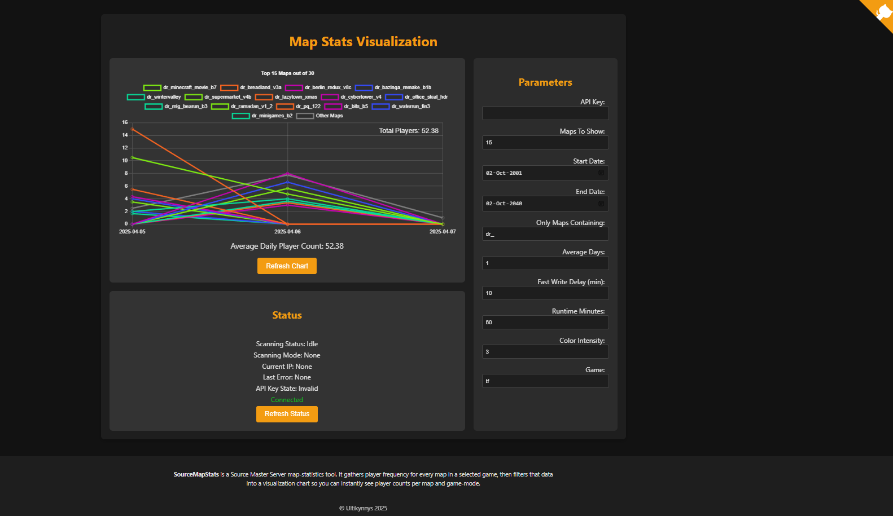
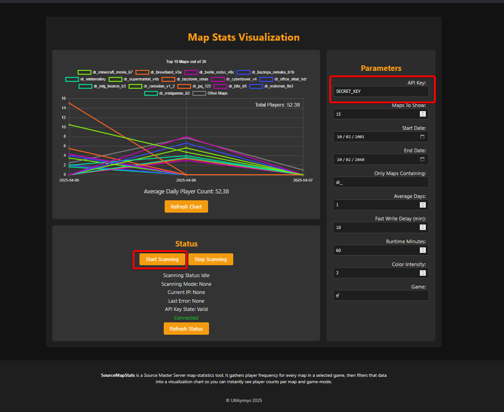

# SourceMapStats

**SourceMapStats** is an end‑to‑end statistics dashboard for Valve Source / GoldSource games.  
It periodically queries public game servers, stores per‑map player counts in a CSV file, and serves an interactive Chart.js dashboard so you can explore which maps are really being played over time.

 <!--‑‑ add your own screenshot -->

---

## Table of Contents
1. [Why?](#why)
2. [Live Demo](#live-demo)
3. [Quick start](#quick-start)
4. [Configuration](#configuration)
5. [REST API](#rest-api)

---

## Why?

I built SourceMapStats for a personal project: I wanted concrete data about which **Team Fortress 2** maps people really play.  
The scanner, however, is game‑agnostic—just change the `Game` parameter and it will happily crawl any Source engine title that’s listed on the Steam Master Server.

---

## Live demo

```
http://127.0.0.1:5000
```

> **Note:** If the **server and browser run on the same machine**, open  
> `http://localhost:5000` (or `http://127.0.0.1:5000`).  
> If the server runs elsewhere on your LAN/VPS, replace the host part with its IP or domain.

---

## Quick start

> Requires **Python 3.9+** (needed by Waitress ≥ 3.0) and **git**.

### 1. Clone & install

```bash
git clone https://github.com/Ultikynnys/SourceMapStats.git
cd SourceMapStats
chmod +x run_app.sh
```

### 2. **Set your own API key**

`config_keys.json` ships with a **placeholder** key. Replace it with your own randomly‑generated token **before** starting the server:

```bash
cp config_keys.json.example config_keys.json
nano config_keys.json
```

```json
{
  "accepted_keys": [
    "CHANGEME‑PUT‑YOUR‑RANDOM‑KEY‑HERE"
  ]
}
```

Use at least 20–30 alphanumeric characters; dashes and underscores are allowed.

### 3. Run the server

```bash
./run_app.sh            # creates venv, installs deps, starts server
```

The script autodetects your local IP and launches the Flask app through **Waitress**.  
Open `http://localhost:5000` (same machine) or `http://<server‑ip>:5000`.

### 4. Start the crawler from the UI

1. Paste your API key into the **“API Key”** field in the right‑hand sidebar.  
2. Click **Start Scanning**.  
3. Watch the status panel update and the chart populate.



> **Tip:** Let the crawler run continuously for **at least one month** to gather enough samples for reliable map‑popularity trends. Shorter runs can be skewed by daily fluctuations and special events.

---

## Configuration

Runtime configuration is stored in‑memory and can be tweaked on the fly via the sidebar or `POST /api/update_params`.

| Key | Type | Default | Description |
|-----|------|---------|-------------|
| `Game` | str | `"tf"` | Short game dir (tf, csgo, etc.). |
| `MapsToShow` | int | `15` | How many top maps to graph. |
| `Start_Date` / `End_Date` | `YYYY‑MM‑DD` | wide range | Date window used when aggregating CSV rows. |
| `AverageDays` | int | `1` | Number of days per bucket for averaging. |
| `FastWriteDelay` | int (min) | `10` | Idle delay between “fast” scans. |
| … | | | see the `config` dict in `app.py`. |

Changes persist **until the process restarts** (no disk write yet).

---

## REST API

All endpoints rate‑limit anonymous callers to **3 req/s**.  
Supply a header `X‑API‑KEY: <your‑token>` to bypass this limit.

| Method | Path | Description |
|--------|------|-------------|
| **GET** | `/api/heartbeat` | Lightweight health‑check. |
| **POST** | `/api/start_scan` | Begin continuous scanning thread (requires API key). |
| **POST** | `/api/stop_scan` | Graceful stop. |
| **GET** | `/api/status` | JSON payload with current scanner state. |
| **GET** | `/api/data` | Chart‑ready JSON (labels, datasets, stats). |
| **POST** | `/api/update_params` | Hot‑patch configuration. |
| **GET** | `/api/params` | Current config. |
| **GET** | `/api/csv_status` | `{ exists: bool, empty: bool }`. |
| **GET** | `/api/connections` | Last 50 requests per IP (admin only). |

Example:

```bash
curl -H "X-API-KEY: YOURTOKEN" -X POST http://localhost:5000/api/start_scan
```
